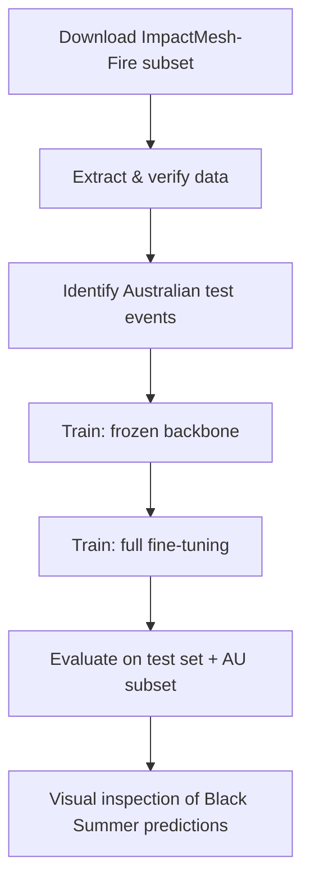
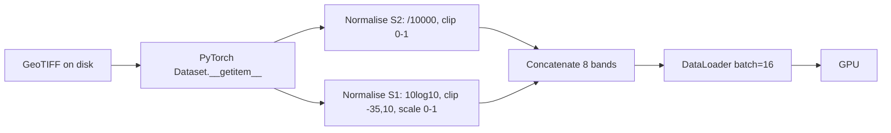

# Engineering Plan: Burn Scar Fine-Tuning with granite-geospatial-uki

## Workflow Overview



## 1. Data Access

### 1.1 ImpactMesh-Fire dataset

| Property | Value |
|----------|-------|
| Source | HuggingFace `ibm-esa-geospatial/ImpactMesh-Fire` |
| Access method | `huggingface_hub` CLI with `--include` filter |
| Modalities downloaded | S2L2A, S1RTC, MASK (skip DEM) |
| Splits | train, val, test + split/*.txt |
| Estimated download | ~30 GB |
| Local path | `data/ImpactMesh-Fire/` |
| Sample format | GeoTIFF or Zarr per sample (TBD — to be confirmed on first extraction) |

**Download command:**
```bash
source ~/venvs/burn-scar/bin/activate
huggingface-cli download ibm-esa-geospatial/ImpactMesh-Fire \
  --repo-type dataset \
  --include "train/S2L2A.tar" "train/S1RTC.tar" "train/MASK.tar" \
            "val/S2L2A.tar" "val/S1RTC.tar" "val/MASK.tar" \
            "test/S2L2A.tar" "test/S1RTC.tar" "test/MASK.tar" \
            "split/*" \
  --local-dir data/ImpactMesh-Fire
```

### 1.2 Foundation model weights

| Property | Value |
|----------|-------|
| Source | HuggingFace `ibm-granite/granite-geospatial-uki` |
| Access method | TerraTorch `BACKBONE_REGISTRY.build()` (auto-downloads) |
| Size | ~400 MB |
| Cached at | `~/.cache/huggingface/` |

### 1.3 Data discovery (TBD during code generation)

Before writing the data loading logic, inspect the first extracted sample to confirm:
- File format (GeoTIFF vs Zarr)
- Band ordering in S2L2A files (is it B02, B03, B04, B8A, B11, B12?)
- S1RTC value range (linear power or dB?)
- Mask encoding (binary 0/1? multi-class? what is the nodata value?)
- Spatial dimensions (expected: 224×224 at 10m)

## 2. Processing Strategy

### 2.1 Environment setup

The EASI environment uses venvs linked to the base image packages. The `burn-scar` venv should already exist at `~/venvs/burn-scar/`. Dependencies are installed within this venv:

```bash
source ~/venvs/burn-scar/bin/activate
pip install --upgrade pip
pip install terratorch impactmesh huggingface_hub rasterio tensorboard
```

No Dask cluster is needed — this is a single-GPU PyTorch training workflow. The DataLoader handles data parallelism via `num_workers`.

### 2.2 Parallelisation unit

**Not applicable for training.** This is a standard single-GPU deep learning workflow:
- Data loading: PyTorch DataLoader with 4 worker processes
- Compute: Single GPU forward/backward pass
- No Dask, no DDP, no FSDP

### 2.3 Data pipeline



**Per-sample memory:** 8 bands × 224 × 224 × 4 bytes (float32) = ~1.6 MB
**Per-batch memory:** 16 × 1.6 MB = ~25 MB (negligible)

### 2.4 Model architecture

```
granite-geospatial-uki backbone (frozen/unfrozen)
    Input: (B, 8, 1, 224, 224)  → ViT encoder
    Output: (B, L, 768) token sequence

Reshape: remove CLS tokens → (B, 768, 14, 14) spatial features

Decoder:
    Conv2d(768→256) + BN + ReLU + Upsample ×2   → (B, 256, 28, 28)
    Conv2d(256→128) + BN + ReLU + Upsample ×2   → (B, 128, 56, 56)
    Conv2d(128→64)  + BN + ReLU + Upsample ×4   → (B, 64, 224, 224)
    Conv2d(64→2, 1×1)                            → (B, 2, 224, 224)

Bilinear interpolate to input resolution if needed
```

### 2.5 Training configuration

| Parameter | Phase 1 (frozen) | Phase 2 (unfrozen) |
|-----------|-------------------|---------------------|
| Epochs | 20 | 10 |
| Batch size | 16 | 8 |
| LR (decoder) | 1e-3 | 1e-4 |
| LR (backbone) | — | 1e-5 |
| Scheduler | CosineAnnealing | CosineAnnealing |
| Loss | Dice + BCE (50/50) | Dice + BCE (50/50) |
| Precision | fp16 (torch.amp) | fp16 (torch.amp) |
| Grad clip | max_norm=1.0 | max_norm=1.0 |
| Weight decay | 1e-4 | 1e-4 |

### 2.6 Evaluation

Metrics computed on the full test set and separately on samples matching `EMSR408*` (Australian Black Summer):
- IoU (burn scar class)
- F1 / Dice
- Precision, Recall

## 3. Resource Requirements

| Resource | Requirement |
|----------|-------------|
| GPU | 1× (24+ GB VRAM recommended, e.g. A10, V100, A100) |
| GPU memory peak | ~12 GB (Phase 1), ~18 GB (Phase 2 with full model gradients) |
| System RAM | 32 GB |
| Disk | ~35 GB (30 GB dataset + 5 GB checkpoints/logs) |
| Training time | ~2-3 hrs Phase 1, ~2-3 hrs Phase 2 |
| Dask cluster | Not required |

## 4. Risk Analysis

| Risk | Likelihood | Impact | Mitigation |
|------|-----------|--------|-----------|
| No Australian events in dataset | Low (EMSR408 confirmed in test split) | Cannot evaluate AU performance | Fall back to global metrics; source DEA burnt area for validation |
| S1 normalisation mismatch | Medium | Poor SAR feature learning | Inspect first sample; compare value ranges to granite-uki docs |
| OOM on Phase 2 | Medium | Training crashes | Reduce batch to 4; enable gradient checkpointing |
| Backbone output format unexpected | Medium | Model won't train | Inspect backbone output shape on dummy input before training |
| Band ordering wrong | Medium | Garbage predictions | Validate against granite-uki model card band order |

## 5. Milestones (maps to science plan)

### M1: Dataset downloaded and verified
**Technical:** All 9 tar files extracted. Split .txt files present. Sample count ~22K across splits.
**Validation:** Load one random sample, display S2 RGB + S1 VV + mask side-by-side.

### M2: Australian events identified in test set
**Technical:** Grep split files for `EMSR408` (or other AU EMSR codes). Count samples.
**Validation:** ≥50 samples with AU-related EMSR codes in test split.

### M3: Training converges (Phase 1)
**Technical:** Loss decreasing, val IoU > 0.45 by epoch 15.
**Validation:** Plot loss and IoU curves.

### M4: Training converges (Phase 2)
**Technical:** Val IoU improves over Phase 1 best, no catastrophic forgetting.
**Validation:** Plot loss/IoU curves continuing from Phase 1.

### M5: Australian evaluation
**Technical:** IoU > 0.50 on AU test subset.
**Validation:** 4-panel visualisation (S2 RGB, S1 VV, ground truth, prediction) for 3-5 Black Summer events.

## 6. Code Structure

```
kiro-foundation-model/
├── README.md
├── science-plan.md
├── engineering-plan.md
├── workflow.ipynb              # Orchestration notebook (milestone-per-section)
├── modules/
│   ├── __init__.py
│   ├── data.py                # Dataset class, normalisation, split loading
│   ├── model.py               # GraniteUKIBurnScar model definition
│   ├── train.py               # Training loop, evaluation, checkpointing
│   └── visualisation.py       # Prediction overlays, training curves
├── tests/
│   ├── conftest.py
│   ├── test_data.py           # Normalisation correctness, band ordering
│   ├── test_model.py          # Forward pass shape, backbone output handling
│   └── test_train.py          # Loss computation, metric calculation
├── configs/
│   └── default.yaml           # Training hyperparameters (optional TerraTorch-compatible)
├── docs/
│   └── venv-setup.md
└── easi-notebooks-ddp/        # Reference code (cloned PR #32)
```

**Module responsibilities:**

| Module | Key Functions |
|--------|--------------|
| `modules/data.py` | `ImpactMeshFireDataset`, `normalize_s2()`, `normalize_s1()`, `get_split_samples()`, `identify_australian_events()` |
| `modules/model.py` | `GraniteUKIBurnScar` (nn.Module with frozen/unfrozen backbone + decoder) |
| `modules/train.py` | `train_epoch()`, `val_epoch()`, `compute_iou()`, `dice_bce_loss()` |
| `modules/visualisation.py` | `plot_training_curves()`, `plot_prediction_panels()`, `display_sample()` |

**Test strategy:**

| Test File | What | Data |
|-----------|------|------|
| `test_data.py` | S1/S2 normalisation ranges, band concatenation shape | Synthetic arrays |
| `test_model.py` | Forward pass produces (B, 2, 224, 224) from (B, 8, 224, 224) input | Random tensors |
| `test_train.py` | Dice+BCE loss on known inputs, IoU metric correctness | Synthetic logits/masks |

## 7. Notebook Outline

| Cell | Type | Milestone | Purpose |
|------|------|-----------|---------|
| 1 | Markdown | — | Science plan summary, milestone overview |
| 2 | Code | — | Configuration: paths, hyperparams, feature flags |
| 3 | Code | — | Verify venv, GPU availability, imports |
| 4 | Markdown | M1 | Context: dataset structure |
| 5 | Code | M1 | Download + extract (if not already present) |
| 6 | Code | M1 | Verify sample counts, display random sample |
| 7 | Markdown | M2 | Context: identifying AU events |
| 8 | Code | M2 | Filter split files for EMSR408, report counts |
| 9 | Markdown | M3 | Context: Phase 1 training |
| 10 | Code | M3 | Run Phase 1 training loop |
| 11 | Code | M3 | Plot training curves, checkpoint best model |
| 12 | Markdown | M4 | Context: Phase 2 training |
| 13 | Code | M4 | Run Phase 2 training loop |
| 14 | Code | M4 | Plot training curves |
| 15 | Markdown | M5 | Context: AU evaluation |
| 16 | Code | M5 | Evaluate on full test + AU subset |
| 17 | Code | M5 | 4-panel prediction visualisation for Black Summer |
| 18 | Markdown | — | Summary: metrics table, next steps |
